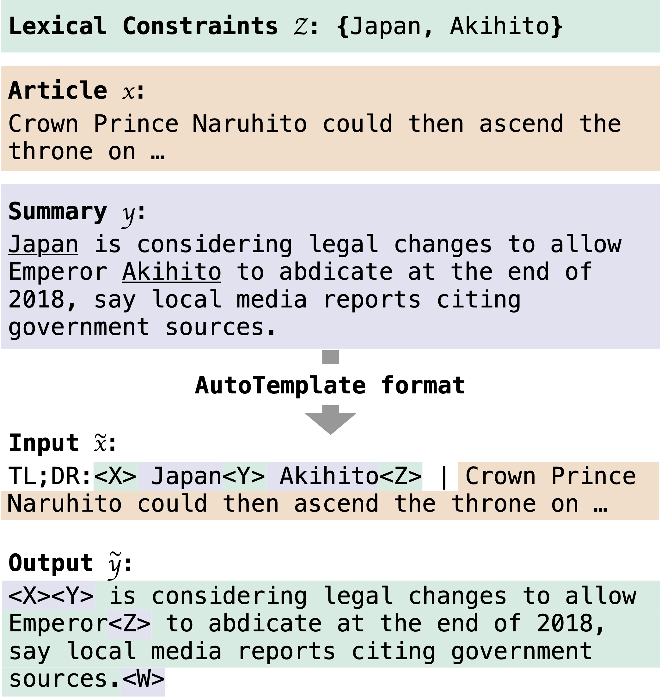

# AutoTemplate: A Simple Recipe for Lexically Constrained Text Generation

[]()
[](https://arxiv.org/abs/2211.08387)

This repository contains the code for AutoTemplate: A Simple Recipe for Lexically Constrained Text Generation.

<p align="center">
    
<p>

## Citations
```bibtex
@inproceedings{iso2024autotemplate,
    title = "AutoTemplate: A Simple Recipe for Lexically Constrained Text Generation",
    author = {Iso, Hayate},
    booktitle = "INLG",
    year = "2024",
    url = "https://arxiv.org/abs/2211.08387",
}
```

## Setup

- You can install most of the dependencies with the following commands.

```shell
pip install -r requirements.txt
```

- To evaluate the keywords-to-sentence generation models with METEOR v1.5 score, you can follow the following link to
  install: https://www.cs.cmu.edu/~alavie/METEOR/README.html
- To evaluate the entity-guided summarization with ROUGE scores, we used
  the ```files2rouge```: https://github.com/pltrdy/files2rouge

## Keywords-to-Sentence generation task

### 1. Download the raw datasets

- You can download the raw datasets in the following link: https://github.com/NLPCode/CBART
- Then, you can decompress these datasets and place them under ``data``.

### 2. Preprocess the datasets

- Run the following to automatically create the train/dev/test splits from raw datasets.

```shell
python scripts/prep_k2s.py
```

### 3. Run the training script

- You can train the automatic template generation model with the following commands.
- You can also specify the initial pre-trained checkpoint by changing the ```model_name``` parameter.

```shell
python train.py ./data/one-billion-words ./log/one-billion-words --model_name google/t5-v1_1-large
python train.py ./data/yelp_review ./log/yelp_review --model_name google/t5-v1_1-large
```

### 4. Generate sentences from the pre-specified keywords

- You can generate sentences from the set of keywords.
- If you want to generate the sentences from the different number of keywords, you need to change the model input.

```shell
python generate.py \
 ./data/one-billion-words/1keywords.jsonl \  # Input path
 ./log/one-billion-words/checkpoint-100000 \  # Model checkpoint
 ./log/one-billion-words/checkpoint-100000/1keywords.txt  # Output path
```

### 5. Evaluate the generated sentences

- Finally, you can evaluate the generated sentences with the following command.
- Note that you need to store generated files with 1-6 keywords to perform evaluation.

```shell
python scripts/evaluate_k2s.py \
 ./data/one-billion-words/ \  # directory of reference files
./log/one-billion-words/checkpoint-100000/  # directory of hypothesis files
```

## Entity-guided summarization

### 1. Download the raw datasets

- We used two major summarization datasets, [CNNDM](https://github.com/abisee/cnn-dailymail)
  and [XSUM](https://github.com/EdinburghNLP/XSum).
- You can follow the preprocessing decision made by the BART model refer to this README
  document: https://github.com/facebookresearch/fairseq/blob/main/examples/bart/README.summarization.md

### 2. Preprocess the datasets

Run the following to automatically create the train/dev/test splits of the entity-guided summarization datasets.

```shell
python scripts/prep_sum.py data/cnndm
python scripts/prep_sum.py data/xsum
```

### 3. Run the training script

- You can train the automatic template generation model with the following commands.
- You can also specify the initial pre-trained checkpoint by changing the ```model_name``` parameter.

```shell
python train.py ./data/cnndm ./log/cnndm --model_name google/t5-v1_1-large
python train.py ./data/xsum ./log/xsum --model_name google/t5-v1_1-large
```

### 4. Generate summaries based on the source article and constrained entities

- If you want to generate the summaries of the XSum, you need to change the model input and the checkpoint.

```shell
python generate.py \
 ./data/cnndm/test.jsonl \  # Input path
 ./log/cnndm/checkpoint-100000 \  # Model checkpoint
 ./log/cnndm/checkpoint-100000/test.hypo  # Output path
```

### 5. Evaluate the generated summaries

- Finally, you can evaluate the generated summaries using ```files2rouge```

```shell
files2rouge ./data/cnndm/test.target ./log/cnndm/checkpoint-100000/test.hypo
```

---

### Disclosure

Embedded in, or bundled with, this product are open source software (OSS) components, datasets and other third party
components identified below. The license terms respectively governing the datasets and third-party components continue
to govern those portions, and you agree to those license terms, which, when applicable, specifically limit any
distribution. You may receive a copy of, distribute and/or modify any open source code for the OSS component under the
terms of their respective licenses, which may be BSD 3 clause license and Apache 2.0 license. In the event of conflicts
between Megagon Labs, Inc., license conditions and the Open Source Software license conditions, the Open Source Software
conditions shall prevail with respect to the Open Source Software portions of the software.

You agree not to, and are not permitted to, distribute actual datasets used with the OSS components listed below. You
agree and are limited to distribute only links to datasets from known sources by listing them in the datasets overview
table below. You are permitted to distribute derived datasets of data sets from known sources by including links to
original dataset source in the datasets overview table below. You agree that any right to modify datasets originating
from parties other than Megagon Labs, Inc. are governed by the respective third party’s license conditions.

All OSS components and datasets are distributed WITHOUT ANY WARRANTY, without even implied warranty such as for
MERCHANTABILITY or FITNESS FOR A PARTICULAR PURPOSE, and without any liability to or claim against any Megagon Labs,
Inc. entity other than as explicitly documented in this README document. You agree to cease using any part of the
provided materials if you do not agree with the terms or the lack of any warranty herein.

While Megagon Labs, Inc., makes commercially reasonable efforts to ensure that citations in this document are complete
and accurate, errors may occur. If you see any error or omission, please help us improve this document by sending
information to contact_oss@megagon.ai.
